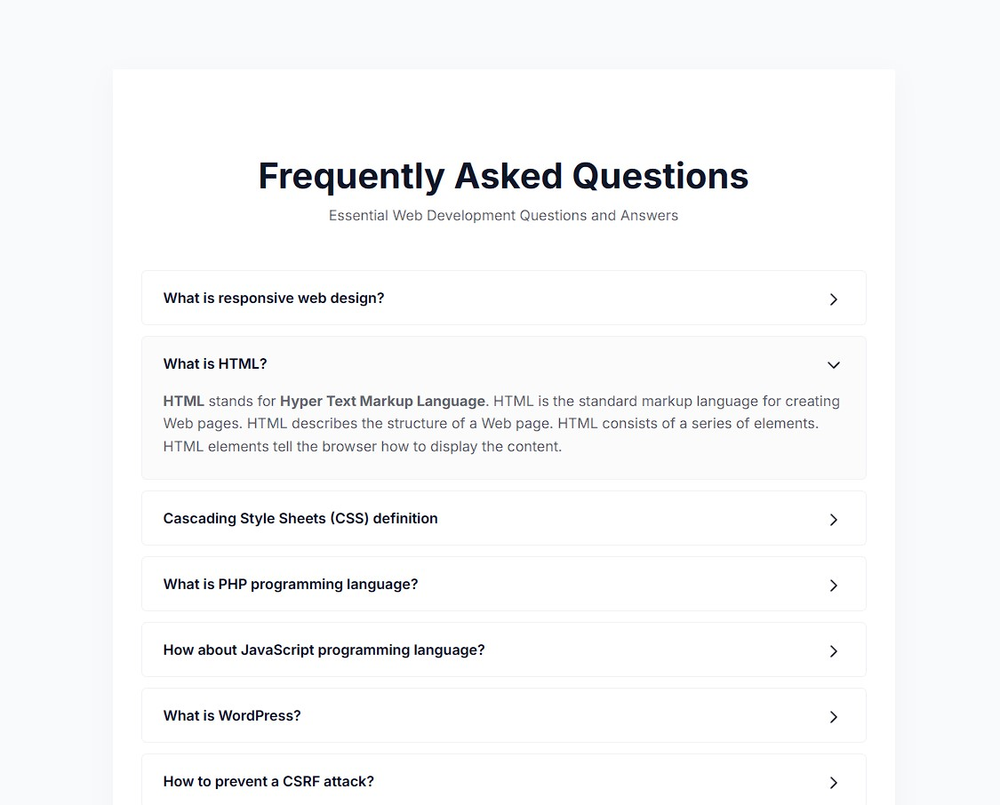

# uix-26
[UIX 26](https://suiramus.github.io/uix-26/)  

### Accordion 26
[https://suiramus.github.io/uix-26/accordion-26](https://suiramus.github.io/uix-26/accordion-26)  

<!--  -->

### Accordion 26+ (Vanilla JS + Details + Hybrid)

Accordion Vanilla JS 
[https://suiramus.github.io/uix-26/acc26plus](https://suiramus.github.io/uix-26/acc26plus) 

Accordion with Details (just CSS) 
[https://suiramus.github.io/uix-26/acc26plus/index-details.html](https://suiramus.github.io/uix-26/acc26plus/index-details.html) 

Accordion Hybrid (Details + JS)
[https://suiramus.github.io/uix-26/acc26plus/index-hybrid.html](https://suiramus.github.io/uix-26/acc26plus/index-hybrid.html) 

   
### Menu Accesibil
[https://suiramus.github.io/uix-26/menu-accesibil](https://suiramus.github.io/uix-26/menu-accesibil)  

### FAQ Accordion Simple (Gem)
[https://suiramus.github.io/uix-26/faq-simple](https://suiramus.github.io/uix-26/faq-simple)  

### FAQ Accordion Accesible (Deep)
[https://suiramus.github.io/uix-26/faq-accesible](https://suiramus.github.io/uix-26/faq-accesible)  

